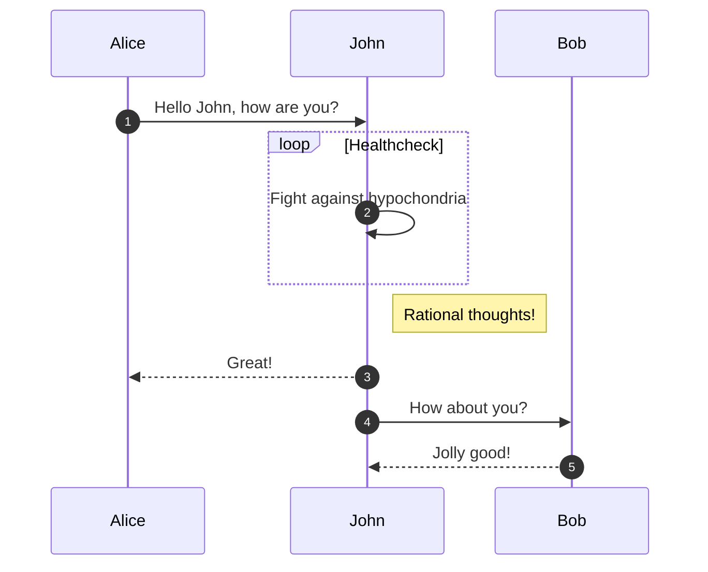
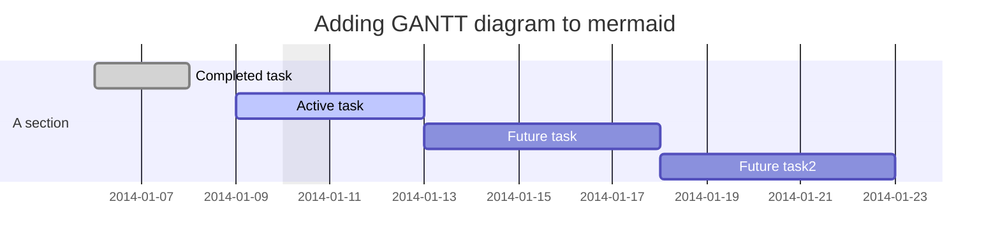
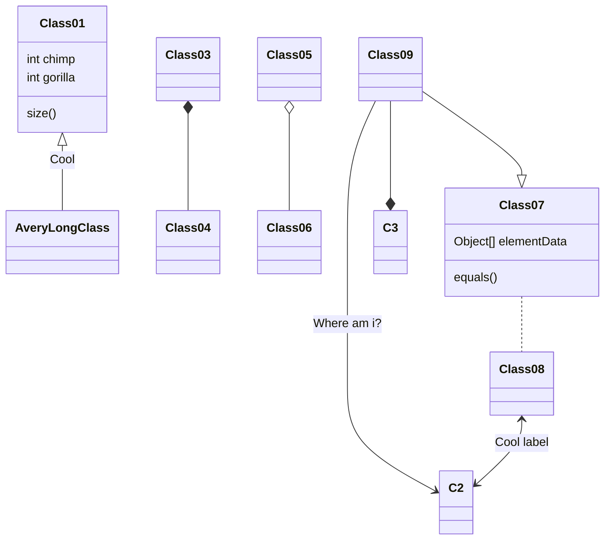

# TestNote1

When $a \ne 0$, there are two solutions to $(ax^2 + bx + c = 0)$ and they are 
$$ x = {-b \pm \sqrt{b^2-4ac} \over 2a} $$

## Hello Markdown in VS Code!

This is a simple introduction to compiling Markdown in VS Code.

Things you'll need:

* [Node.js](https://nodejs.org)
* [markdown-it](https://www.npmjs.com/package/markdown-it)
* [tasks.json](/docs/editor/tasks)

## Section Title

> This block quote is here for your information. 

::: mermaid
graph TD;
    A-->B;
    A-->C;
    B-->D;
    C-->D;
:::

::: mermaid
sequenceDiagram
    Alice->>John: Hello John, how are you?
    John-->>Alice: Great!
    Alice-)John: See you later!
:::

